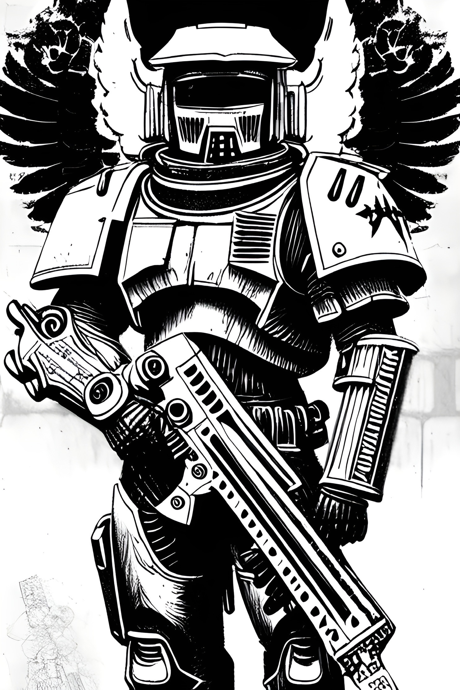

Certainly! While I may not have access to all of the rules for Zweihander, I can still create a rough draft for the Proto-Vanguard profession based on your description. Here's a starting point for you to develop further and tailor to the specific rules and mechanics of the game:

Proto-Vanguard Profession
Primary Attribute: Combat

Profession Traits:

Mutagenic Resilience: As a result of their mutations, Proto-Vanguards have a heightened resistance to physical harm. They gain a bonus to their Toughness attribute, making them more resilient in combat.

Enhanced Reflexes: The mutagens coursing through their veins grant Proto-Vanguards increased agility and reaction speed. They gain a bonus to their Agility attribute, allowing them to act and react faster in combat situations.

Volatile Mutation: While the Proto-Vanguard's mutations grant them powerful abilities, they also come with a cost. Whenever they suffer a critical hit or fail a challenging combat-related skill check, they must roll on the Volatile Mutation table to determine a random side effect that occurs. These side effects could range from temporary debuffs to their attributes or skills, to more severe consequences that require immediate attention.

Martial Prowess: The rigorous training and martial techniques passed down from the Astral Vanguard make the Proto-Vanguards skilled warriors. They gain a bonus to their Melee or Ranged attack skill, depending on their chosen specialization.

Indomitable Will: The weight of their role and the side effects of their mutations have forged Proto-Vanguards into mental fortresses. They gain a bonus to their Willpower attribute, making them less susceptible to fear and mental manipulation.

Drawbacks:

Mutagen Dependency: Proto-Vanguards require regular doses of specialized mutagens to maintain their abilities and stave off the worst side effects of their mutations. They must track their supply of mutagens and ensure they do not run out, or risk suffering debilitating withdrawal symptoms that can hinder them in and out of combat.

Outsider Status: As members of an experimental fighting force, Proto-Vanguards are often viewed with a mixture of admiration and suspicion by the citizens of Harbor. They may face social challenges, prejudice, or even outright hostility from certain factions within the city.

This rough draft should give you a starting point to develop the Proto-Vanguard profession further, customizing it to fit the rules and mechanics of Zweihander and the unique lore of your world.

## Volatile Mutation Table

Click to expand

| Roll   | Effect                                                                 |
|--------|-----------------------------------------------------------------------|
| 1-5    | Uncontrolled Tremors: -10 to Agility for 1d10 rounds                  |
| 6-10   | Sudden Fatigue: -10 to Toughness for 1d10 rounds                      |
| 11-15  | Sensory Overload: -10 to Perception for 1d10 rounds                   |
| 16-20  | Muscle Spasms: -10 to Melee or Ranged attack skill for 1d10 rounds   |
| 21-25  | Unstable Mind: -10 to Willpower for 1d10 rounds                       |
| 26-30  | Swollen Limb: Movement speed reduced by half for 1d10 rounds         |
| 31-35  | Sudden Nausea: Must pass a Toughness test or become Incapacitated for 1 round |
| 36-40  | Momentary Blindness: -20 to Perception for 1d10 rounds                |
| 41-45  | Severe Headache: -10 to Intelligence for 1d10 rounds                  |
| 46-50  | Painful Cramps: -10 to all Physical attributes for 1d10 rounds        |
| 51-55  | Uncontrollable Rage: Must attack nearest target, friend or foe, for 1d10 rounds |
| 56-60  | Skin Rashes: -10 to Fellowship for 1d10 rounds due to discomfort and appearance |
| 61-65  | Persistent Itch: -10 to Initiative for 1d10 rounds                    |
| 66-70  | Memory Lapse: Lose access to one random learned skill for 1d10 rounds |
| 71-75  | Slurred Speech: -10 to Communication for 1d10 rounds                  |
| 76-80  | Minor Mutation: Gain a temporary, benign mutation for 1d10 rounds (e.g., oddly colored eyes, faint glow, etc.) |
| 81-85  | Clumsiness: -10 to all actions involving fine motor skills for 1d10 rounds |
| 86-90  | Mood Swings: -10 to all Social attributes for 1d10 rounds              |
| 91-95  | Shivering: -10 to all actions for 1d10 rounds due to uncontrollable shivering |
| 96-100 | Major Mutation: Gain a temporary, harmful mutation for 1d10 rounds (e.g., limb turns to tentacle, body becomes partially ethereal, etc.) |

## Mutagen Withdrawal Table

Click to expand

| Roll  | Effect                                                      |
|-------|-------------------------------------------------------------|
| 1-5   | Weakness: -10 to Strength for 1d10 hours                   |
| 6-10  | Sluggishness: -10 to Agility for 1d10 hours                 |
| 11-15 | Frailty: -10 to Toughness for 1d10 hours                    |
| 16-20 | Confusion: -10 to Intelligence for 1d10 hours               |
| 21-25 | Anxiety: -10 to Willpower for 1d10 hours                    |
| 26-30 | Irritability: -10 to Fellowship for 1d10 hours              |
| 31-35 | Vertigo: -10 to Perception for 1d10 hours                   |
| 36-40 | Hallucinations: -10 to Initiative for 1d10 hours            |
| 41-45 | Insomnia: Cannot rest or recover for 1d10 hours             |
| 46-50 | Shaking: -10 to all actions requiring fine motor skills for 1d10 hours |
| 51-55 | Mood Swings: -10 to all social attributes for 1d10 hours    |
| 56-60 | Nausea: Must pass a Toughness test or become Incapacitated for 1d10 minutes |
| 61-65 | Headache: -10 to all actions for 1d10 hours due to severe headache |
| 66-70 | Sweating: -10 to all physical attributes for 1d10 hours due to profuse sweating |
| 71-75 | Muscle Aches: Movement speed reduced by half for 1d10 hours |
| 76-80 | Cravings: Obsession with finding and consuming more mutagens for 1d10 hours |
| 81-85 | Paranoia: -10 to all Perception-based actions for 1d10 hours |
| 86-90 | Nightmares: Cannot rest or recover for 1d10 hours due to vivid nightmares |
| 91-95 | Fainting Spells: Must pass a Toughness test or fall unconscious for 1d10 minutes |
| 96-100 | Seizures: Suffer a violent seizure, becoming incapacitated for 1d10 minutes |

